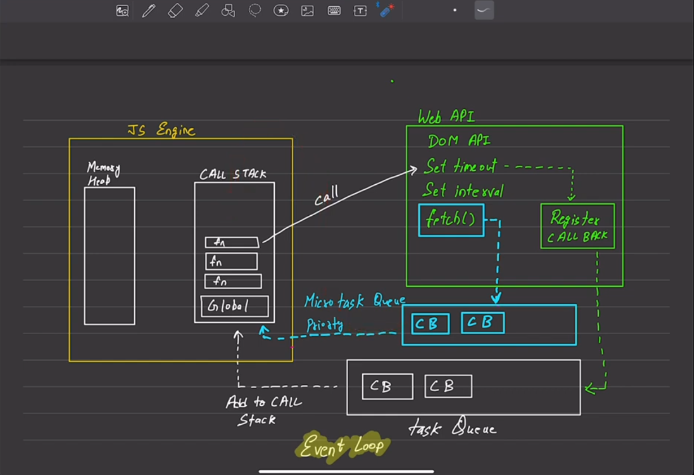
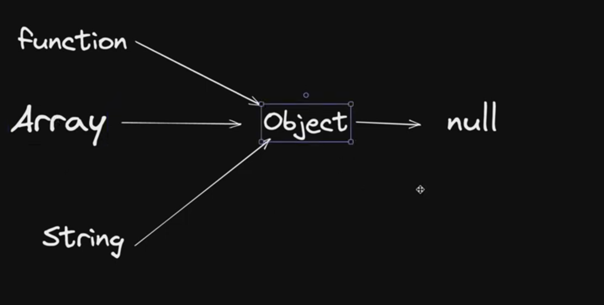

# Important Note

A [`fetch()`](https://developer.mozilla.org/en-US/docs/Web/API/fetch) promise only rejects when a network error is encountered (which is usually when there's a permissions issue or similar). A [`fetch()`](https://developer.mozilla.org/en-US/docs/Web/API/fetch) promise _does not_ reject on HTTP errors (`404`, etc.). Instead, a `then()` handler must check the [`Response.ok`](https://developer.mozilla.org/en-US/docs/Web/API/Response/ok) and/or [`Response.status`](https://developer.mozilla.org/en-US/docs/Web/API/Response/status) properties.

# javascript and classes

## OOP

## Object

- collection of properties and methods
- toLowerCase

## why use OOP

## parts of OOP

Object literal

- Constructor function
- Prototypes
- Classes
- Instances (new, this)

## 4 pillars

* Abstraction
* Encapsulation
* Inheritance
* Polymorphism

### _Prototype_

- Prototype is the reason we can use access the "new" keyword
- Classes, "this" keyword
- Prototypal inheritance, or Simply Js interitance are also present due to this

## Everything goes to Object (it is the superior in object)

